# TrazaRAEE App

PWA para usar en planta (celular o tablet) en una cooperativa de reciclaje informático: recibir lotes, etiquetar equipos con QR, registrar pruebas, borrado de datos, desarme, ventas, donaciones y salidas de scrap. Funciona sin conexión y sincroniza sola cuando vuelve la señal. Repo hermano: `trazaraee-api`.

> **Estado: prototipo.** Las pantallas siguen un flujo inferido de información pública sobre cooperativas de este tipo (ingreso → prueba → desarme/borrado → venta, donación o scrap). **No fue probado en un galpón real ni con usuarios.** La interfaz se recorrió de punta a punta en un Chromium con formato de celular contra la API real (ver Capturas), pero no en dispositivos reales. Lo primero que hay que hacer con esto es llevarlo a una planta y mirar cómo se trabaja de verdad.

## Capturas

Tomadas en Chromium con viewport de celular (390×844) contra la API real, con **datos de demo ficticios** (ninguna empresa, institución ni equipo es real). Los flujos de ingreso, desarme y el caso sin conexión se hicieron manejando la interfaz, no cargando datos por detrás.

**En planta**

<table>
  <tr>
    <td align="center" width="33%">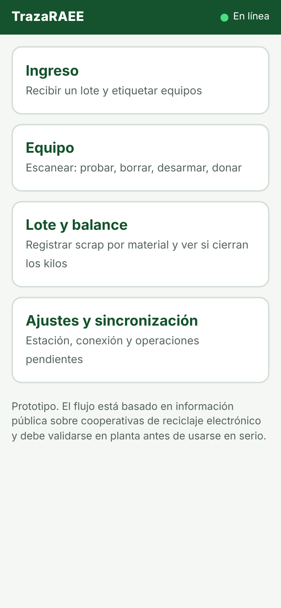<br><sub>Inicio</sub></td>
    <td align="center" width="33%">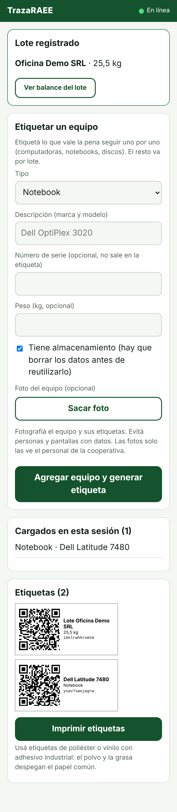<br><sub>Ingreso de lote y etiquetas QR</sub></td>
    <td align="center" width="33%">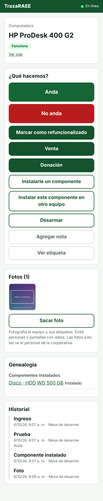<br><sub>Equipo: acciones válidas, genealogía e historial</sub></td>
  </tr>
  <tr>
    <td align="center">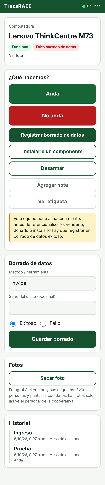<br><sub>Venta, donación y reuso bloqueados hasta registrar el borrado de datos</sub></td>
    <td align="center">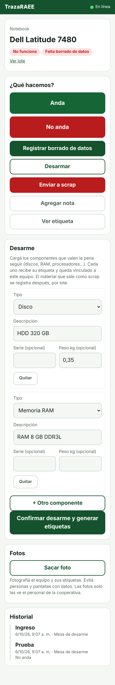<br><sub>Desarme: cada componente rescatado recibe su propio QR</sub></td>
    <td align="center">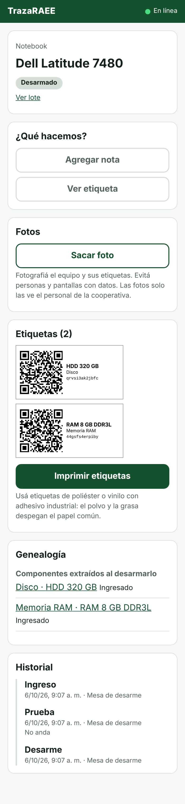<br><sub>Etiquetas de los componentes y su vínculo con el equipo de origen</sub></td>
  </tr>
  <tr>
    <td align="center">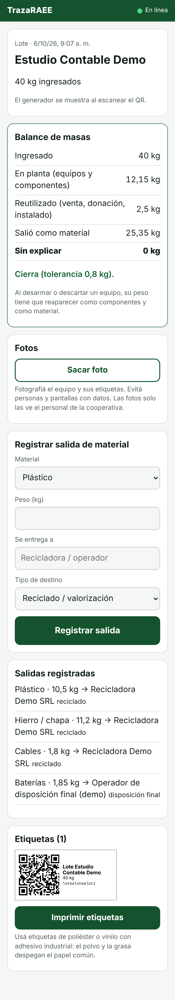<br><sub>Lote: salidas de material y balance de masas</sub></td>
    <td align="center">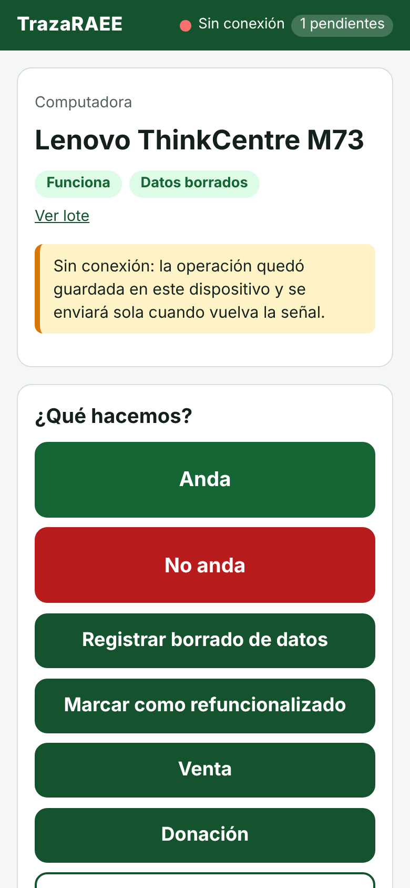<br><sub>Sin conexión: la operación queda guardada y se envía sola al volver la señal</sub></td>
    <td></td>
  </tr>
</table>

**Lo que ve quien escanea el QR** (sin iniciar sesión)

<table>
  <tr>
    <td align="center" width="33%">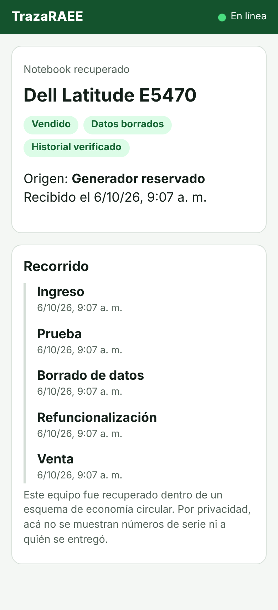<br><sub>Equipo: origen reservado, recorrido y verificación del historial. Sin serial ni destinatario.</sub></td>
    <td align="center" width="33%">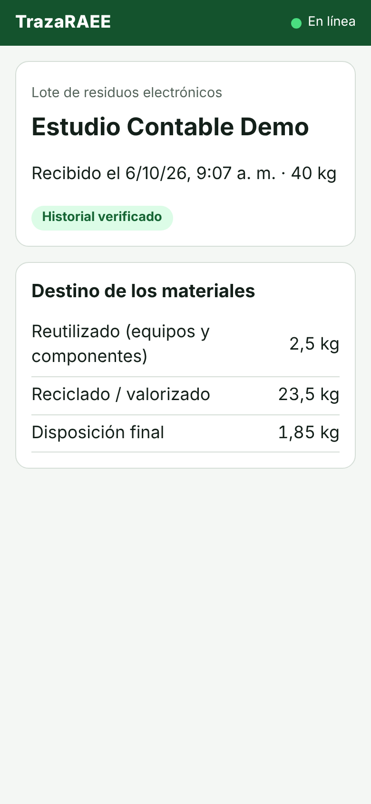<br><sub>Lote: a dónde fue cada kilo (reuso, reciclado, disposición final)</sub></td>
    <td></td>
  </tr>
</table>

**Fotos** (las imágenes de estas capturas son placeholders sintéticos, no equipos reales):

<table>
  <tr>
    <td align="center" width="25%">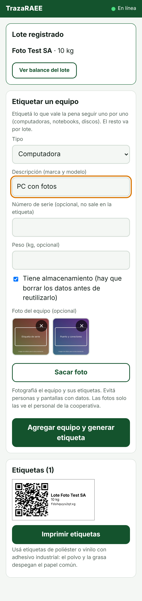<br><sub>Ingreso: fotos del equipo antes de registrarlo</sub></td>
    <td align="center" width="25%">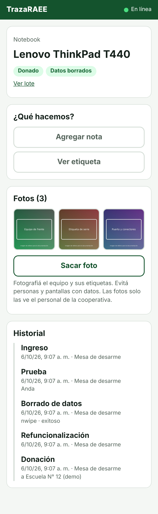<br><sub>Equipo: galería de fotos</sub></td>
    <td align="center" width="25%">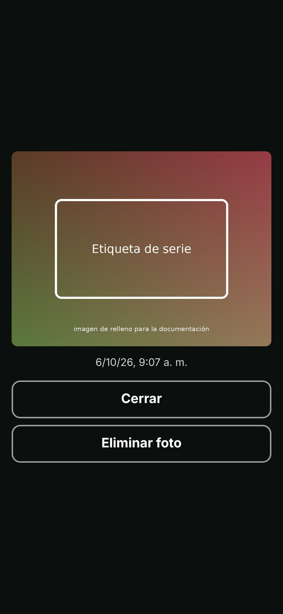<br><sub>Visor, con opción de eliminar</sub></td>
    <td align="center" width="25%">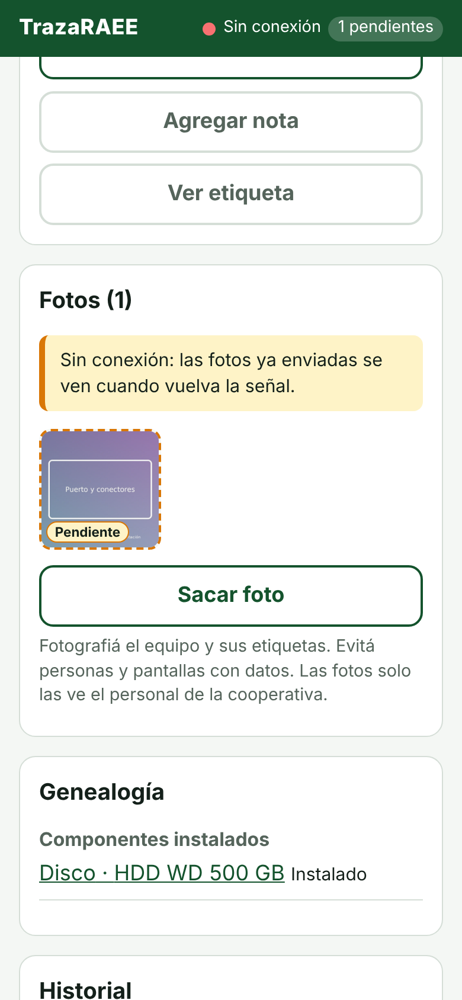<br><sub>Sin conexión: la foto queda "Pendiente" y se envía sola</sub></td>
  </tr>
</table>

## Pantallas

| Ruta | Para qué |
|---|---|
| `/ingreso` | Registrar un lote (generador, peso) y etiquetar equipos; imprime etiquetas |
| `/equipo` → `/equipo/:id` | Escanear un equipo: sólo muestra las acciones válidas según su estado (prueba, borrado, refuncionalizar, venta, donación, desarme, instalar componente, scrap) |
| `/lote` → `/lote/:id` | Registrar salidas de material por fracción y ver el balance de masas |
| `/ajustes` | Servidor, clave de la estación, operaciones pendientes y rechazadas |
| `/a/:id`, `/l/:id` | **Vista pública** que abre quien escanea el QR (sin serial, sin destinatarios, sin personas) |

## Decisiones de diseño

- **Offline primero.** Los IDs y un `client_id` por operación se generan en el dispositivo. Las escrituras que no llegan al servidor van a una cola en IndexedDB y se reenvían en orden; reintentar nunca duplica (el backend es idempotente por `client_id` / `public_id`). Las etiquetas QR se generan en el dispositivo, así que se pueden imprimir sin conexión.
- **Operaciones rechazadas no se pierden en silencio.** Si el servidor rechaza algo que se hizo offline (por ejemplo vender un equipo sin borrado de datos), va a "rechazadas" en Ajustes para reintentar o descartar, y no frena al resto de la cola.
- **Estado anticipado sin conexión.** Mientras una operación está en cola, la app anticipa el nuevo estado con una copia de la máquina de estados (`src/actions.ts`, espejo de `app/rules.py` del backend). La fuente de verdad es siempre el servidor.
- **Estaciones, no personas.** La clave identifica un puesto de trabajo (mesa de desarme, banco de pruebas). La app no pide ni muestra quién hizo cada paso.
- **Hecha para el galpón:** botones grandes, pocos pasos por pantalla, escaneo antes que tipeo, contraste alto, modo oscuro automático.
- **Etiquetas 60×30 mm** con QR, descripción y código corto. El número de serie nunca va en la etiqueta. Usá poliéster/vinilo con adhesivo industrial.

## Fotos

Cada lote y cada equipo puede llevar fotos de lo que se está reciclando ("Sacar foto" en el ingreso y en las pantallas de equipo y lote).

- **Cámara nativa.** Se usa un campo de archivo con `capture="environment"`: en el celular abre la cámara trasera sin pedir permisos ni código propio; en una compu abre el selector de archivos.
- **Se reducen en el dispositivo** (lado máximo 1600 px, JPEG calidad 0,8). Al volver a codificar la imagen se pierden los metadatos EXIF, incluida la ubicación GPS, y se respeta la orientación.
- **Funcionan sin conexión.** La foto se guarda en la cola (IndexedDB) y se envía en orden, después de crear el lote o equipo. Se ve marcada como "Pendiente".
- **Son privadas.** Solo las ven las estaciones autenticadas; nunca aparecen en la vista pública ni en su historial.
- **Se pueden eliminar.** Borra la imagen del servidor; el historial conserva que existió una foto (con su hash), no la imagen.

## Correr en desarrollo

```bash
npm install
cp .env.example .env     # ajustá VITE_API_URL si la API no está en localhost:8000
npm run dev              # http://localhost:5173
```

Para que la cámara funcione en un celular hace falta HTTPS (o `localhost`). En la práctica: desplegar con TLS, o usar un túnel durante las pruebas. La lectura de QR usa `BarcodeDetector` (Chrome/Edge en Android); en otros navegadores queda el ingreso manual del código impreso en la etiqueta.

## Producción

```bash
VITE_API_URL=https://api.ejemplo.org VITE_PUBLIC_URL=https://app.ejemplo.org npm run build
# servir dist/ como sitio estático con fallback a index.html (SPA)
```

`VITE_PUBLIC_URL` es lo que queda codificado en los QR: tiene que ser la dirección definitiva, porque las etiquetas pegadas en los equipos no se pueden reimprimir fácilmente. En el backend, `PUBLIC_BASE_URL` y `CORS_ORIGINS` deben coincidir.

## Tests

```bash
npm test                                   # lógica pura (IDs, lectura de QR, reglas)
# Cola offline contra una API real (levantá trazaraee-api y creá una estación):
API_URL=http://localhost:8000 STATION_KEY=tr_... npm test
npm run build                              # tipado + build de producción
```

La prueba de integración cubre: guardar sin conexión y sincronizar en orden (lote → equipo → prueba), no duplicar operaciones repetidas, mandar a "rechazadas" lo que el servidor rechaza sin frenar el resto, y conservar la cola cuando el servidor no responde.

## Límites conocidos

- Probada en Chromium de escritorio con formato de celular; **sin probar en dispositivos reales** (lectura de QR con la cámara, impresión de etiquetas, instalación como PWA, Safari y otros navegadores).
- Un equipo que recibe un disco ya borrado no hereda su certificado: el certificado queda en el componente, que se ve en la genealogía del equipo.
- Los íconos de la PWA son un SVG provisorio; para instalarla bien en algunos Android hacen falta PNG de 192 y 512 px.
- El service worker cachea sólo el "cascarón" de la app; no hay búsqueda ni listados offline (se trabaja escaneando equipos que este dispositivo ya vio o creó).
- Sin autenticación de personas, roles ni permisos finos: una clave por estación.
- La cámara (`capture`) **no se probó en celulares reales**; en las pruebas se inyectaron imágenes de prueba en el campo de archivo.
- Eliminar una foto requiere conexión (no se encola).
- La app no detecta personas ni pantallas en las fotos: sólo avisa que hay que evitarlas.
- Interfaz sólo en español.

## Licencia

Pendiente de definir (la idea es software libre, para que otras cooperativas lo puedan reutilizar).
